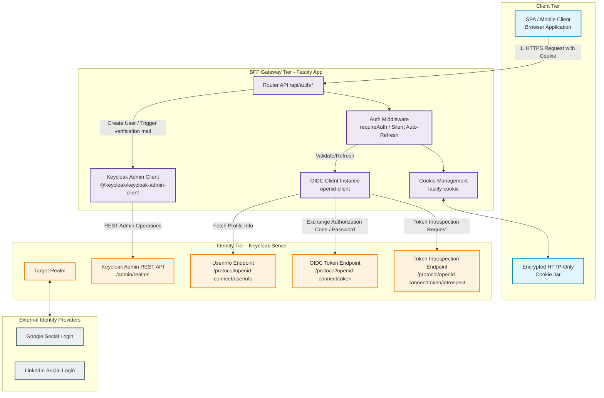
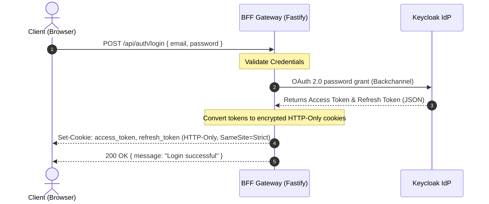
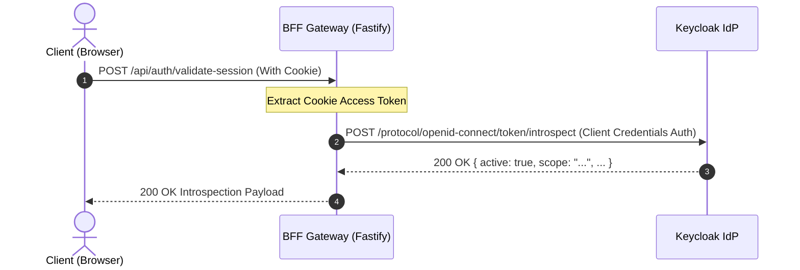
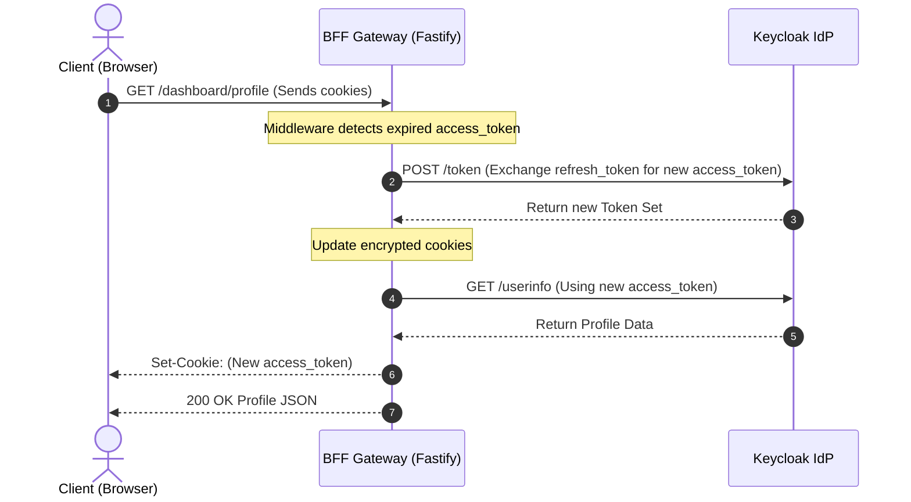

🔴 $\color{red}{\text{WARNING It is in development mode not production ready}}$

# 🔐 Keycloak Secure Backend-for-Frontend (BFF) Gateway

A highly secure, full-stack **Backend-for-Frontend (BFF)** microservice built on **Node.js**, **Fastify**, and **TypeScript**. 

This gateway acts as a secure intermediary between modern Single Page Applications (React, Vue, Angular) and a **Keycloak Identity Provider**, implementing state-of-the-art token-storage security practices.

---

## 🏗️ Architectural Overview & Security Goals

### The Problem: Frontend Token Exposure
Storing OAuth 2.0 / OpenID Connect (OIDC) access tokens, refresh tokens, or ID tokens directly in the browser's memory, `localStorage`, or `sessionStorage` leaves the client highly vulnerable to **Cross-Site Scripting (XSS)** attacks. Any rogue script can steal these credentials and make unauthorized calls.

### The Solution: BFF Pattern
This gateway implements the **BFF (Backend-For-Frontend)** security pattern to isolate tokens entirely from client-side runtime environments:

1. **Token Insulation**: The client never directly sees, receives, or persists raw OAuth tokens.
2. **Double-Locked Cookies**: Tokens returned from Keycloak are immediately stored in secure, encrypted, **HTTP-Only**, **SameSite=Strict**, and **Secure** cookies. 
3. **Transparent Sessions**: The browser automatically forwards these cookies with every API call. The BFF intercepts them, validates them against Keycloak, and forwards the authorization backchannel transparently.
4. **Resilient Middleware**: Token refresh, token introspection, and active session checks are handled entirely on the server-side, protecting the system from client tampering.

### 🗺️ System Component Architecture

> [!NOTE]  
> The diagrams below use standard **Mermaid.js** syntax. If your Markdown viewer does not render Mermaid graphs natively, you can view them perfectly by pasting the code blocks into the [Mermaid Live Editor](https://mermaid.live).

#### 🔀 Text-Based Flow Diagram

Here is a quick textual blueprint of the communication flows:

```text
┌─────────────────────────┐               ┌─────────────────────────────────┐               ┌───────────────────────────────┐
│     CLIENT TIER         │               │     BFF GATEWAY TIER (Node.js)  │               │    IDENTITY PROVIDER TIER     │
│                         │               │                                 │               │                               │
│  ┌───────────────────┐  │  HTTP request │  ┌───────────────────────────┐  │  OIDC Protocol│  ┌─────────────────────────┐  │
│  │   Web Browser     │──┼───────────────┼─>│   Fastify BFF Router      │  │  (Backchannel)│  │     Keycloak Server     │  │
│  │ (SPA/Mobile App)  │  │ (with Cookie) │  │   (/api/auth/*)           │──┼───────────────┼─>│ (Realms, Client Auth)   │  │
│  └───────────────────┘  │               │  └───────────────────────────┘  │               │  └─────────────────────────┘  │
│           │             │               │               │                 │               │               ▲               │
│           │ Reads/Writes│               │               ▼                 │               │               │               │
│           ▼             │               │  ┌───────────────────────────┐  │  Admin API    │               │               │
│  ┌───────────────────┐  │               │  │   Auth & Session          │  │  Backchannel  │               │               │
│  │ Encrypted Cookie  │  │               │  │   Middleware              │──┼───────────────┼───────────────┘               │
│  │     Jar (HTTP)    │  │               │  └───────────────────────────┘  │               │                               │
│  └───────────────────┘  │               │                                 │               │                               │
└─────────────────────────┘               └─────────────────────────────────┘               └───────────────────────────────┘
```

The diagram below illustrates the detailed network-level partitioning and functional roles of each architectural component:



---

## 📊 Sequence Diagrams

### 1. User Authentication & Login Flow



### 2. Backchannel Token Introspection Flow (Validation)



### 3. Silent Token Refresh Middleware



---

## ⚡ Key Features

* **🛡️ Hardened Security**: Full HTTP-Only Cookie session wrapper resisting CSRF and XSS.
* **🔄 Silent Auto-Refresh**: Middleware intercepts requests, inspects token TTLs, and refreshes sessions silently if the access token has expired but the refresh token is valid.
* **🔎 Token Introspection**: `POST /api/auth/validate-session` performs a real-time, OIDC-compliant, server-to-server check directly against Keycloak.
* **✉️ Registration & Backchannel Triggers**: Handles programmatic registrations via the Keycloak Admin Client with automated email verification triggers.
* **🔐 Active Password Change**: `/api/auth/update-password` safely checks current passwords before submitting the secure backchannel update to Keycloak.
* **🌐 Google & LinkedIn Connect**: Seamless redirects for social integrations handled inside Keycloak federation layers.
* **🚀 Production Clustering**: Ready for high-volume loads with `pm2-runtime` clustering and esbuild optimization.

---

## ⚙️ Environment Configuration

Create a `.env` file at the root of the project:

```env
PORT=3000
FRONTEND_URL="http://localhost:5173"

# Keycloak Identity Provider Settings
KEYCLOAK_BASE_URL="https://your-keycloak-domain.com"
KEYCLOAK_REALM="your-realm"
KEYCLOAK_CLIENT_ID="your-client-id"
KEYCLOAK_CLIENT_SECRET="your-client-secret"

# Secure Cryptographic Salt for Session Cookies
COOKIE_SECRET="super-secret-cookie-password-change-me"

# Optional: Direct OIDC Connect Redirects
APP_URL="http://localhost:3000"
GOOGLE_CLIENT_ID="your-google-client-id"
GOOGLE_CLIENT_SECRET="your-google-client-secret"
LINKEDIN_CLIENT_ID="your-linkedin-client-id"
LINKEDIN_CLIENT_SECRET="your-linkedin-client-secret"
```

---

## 🚀 Installation & Operation

### Prerequisites
* **Node.js** `v18+` or later
* **Keycloak Server** (Realm, client ID and client secret created)

### Setup Dependencies
```bash
npm install
```

### Running in Development
Starts the application using `nodemon` and `tsx` for near-instant TypeScript transpilation and hot-reloading:
```bash
npm run dev
```

### Building for Production
Bundle the server into an optimized, self-contained ESM/CommonJS module using `esbuild`:
```bash
npm run build
```

### Running in Production
Starts the application in multi-core **Cluster Mode** using `PM2` runtime configuration defined in `ecosystem.config.cjs`:
```bash
npm run start
```

---

## 📖 Interactive API Specifications

Interactive Swagger-UI documentation is enabled by default in non-production environments.

* **API Docs URL**: `http://localhost:3000/docs`

---

### Authentication Endpoints

#### 1. Register User
* **Route**: `POST /api/auth/register`
* **Body**:
  ```json
  {
    "firstName": "John",
    "lastName": "Doe",
    "email": "johndoe@example.com",
    "password": "SecurePassword123!"
  }
  ```
* **Response (200 OK)**:
  ```json
  {
    "message": "User registered successfully."
  }
  ```
* **Behavior**: Programmatically registers the user inside the Keycloak Realm and automatically dispatches a standard verification link to the target inbox.

---

#### 2. Authenticate & Login
* **Route**: `POST /api/auth/login`
* **Body**:
  ```json
  {
    "email": "johndoe@example.com",
    "password": "SecurePassword123!"
  }
  ```
* **Response (200 OK)**:
  ```json
  {
    "message": "Login successful"
  }
  ```
* **Cookies Set**: 
  - `access_token` (HTTP-Only, Secure, SameSite=Strict)
  - `refresh_token` (HTTP-Only, Secure, SameSite=Strict)

---

#### 3. Terminate Session (Logout)
* **Route**: `POST /api/auth/logout`
* **Response (200 OK)**:
  ```json
  {
    "message": "Logged out successfully"
  }
  ```
* **Behavior**: Destroys local cookies, invalidates session caches, and initiates standard backchannel token revocation with Keycloak.

---

#### 4. Introspect User Session
* **Route**: `POST /api/auth/validate-session`
* **Headers**: Reads authorization bearer token (`Authorization: Bearer <token>`) or automatically extracts the `access_token` cookie.
* **Response (200 OK - Active)**:
  ```json
  {
    "active": true,
    "scope": "openid email profile",
    "client_id": "your-client-id",
    "username": "johndoe@example.com",
    "sub": "7bfa6fa5-2a8d-4f1d-beec-9ef6a07cf402",
    "email_verified": true
  }
  ```
* **Response (401 Unauthorized - Expired/Invalid)**:
  ```json
  {
    "active": false,
    "error": "Session is inactive or expired"
  }
  ```

---

#### 5. Programmatic Password Change
* **Route**: `POST /api/auth/update-password`
* **Security**: Active session cookie required.
* **Body**:
  ```json
  {
    "currentPassword": "SecurePassword123!",
    "newPassword": "BrandNewSecurePassword99!"
  }
  ```
* **Response (200 OK)**:
  ```json
  {
    "message": "Password updated successfully"
  }
  ```

---

#### 6. Forgot/Reset Password Mail Trigger
* **Route**: `POST /api/auth/reset-password`
* **Body**:
  ```json
  {
    "email": "johndoe@example.com"
  }
  ```
* **Response (200 OK)**:
  ```json
  {
    "message": "Password reset email sent."
  }
  ```

---

### Dashboard Endpoints

#### 1. Retrieve User Profile Info
* **Route**: `GET /dashboard/profile`
* **Security**: Active session cookie required. (Will trigger silent token refresh if token expired).
* **Response (200 OK)**:
  ```json
  {
    "sub": "7bfa6fa5-2a8d-4f1d-beec-9ef6a07cf402",
    "email_verified": true,
    "name": "John Doe",
    "preferred_username": "johndoe@example.com",
    "given_name": "John",
    "family_name": "Doe",
    "email": "johndoe@example.com"
  }
  ```

---

## 🛠️ Security Hardening Guidelines

1. **Production Cookies**: Ensure your `FRONTEND_URL` and `APP_URL` configs use HTTPS in production. The gateway automatically enforces Secure cookies when working over secure links.
2. **Backchannel Verification**: Session validations rely directly on cryptographic signatures or explicit backchannel calls (like token introspection), avoiding any dependency on client-provided metadata.
3. **Admin Token Cache**: The Admin API wrapper handles connection Pooling and caching of access tokens to prevent Keycloak rate-limiting during high registration spikes.
